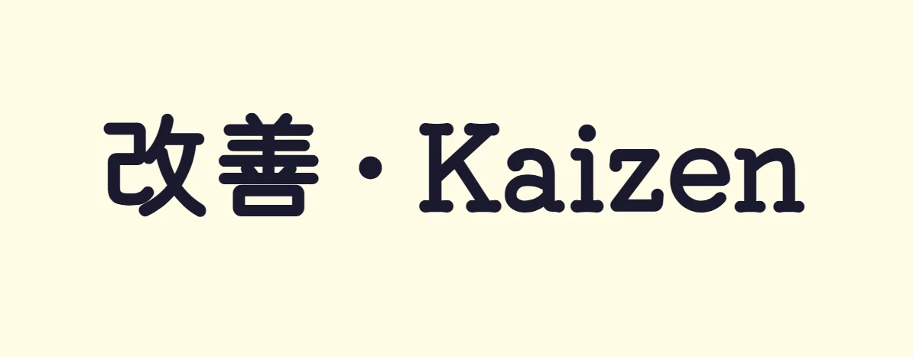
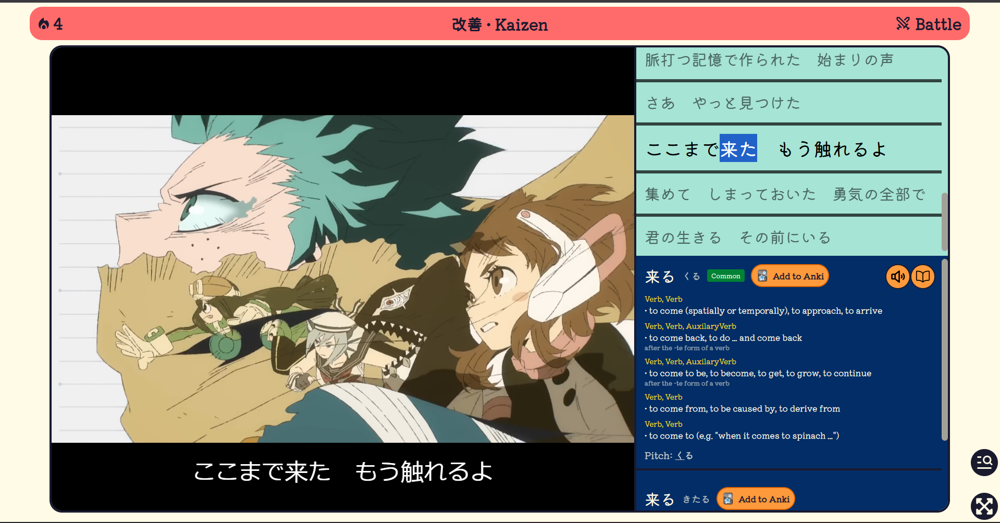
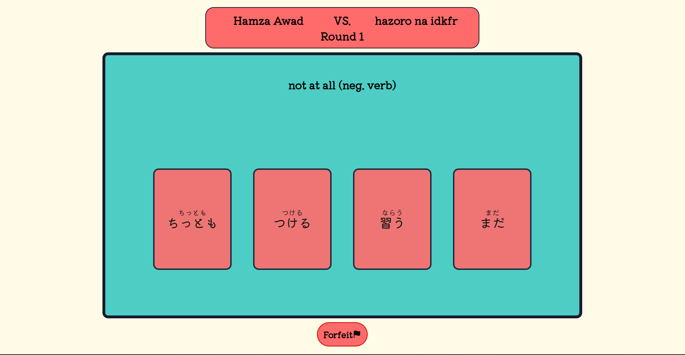
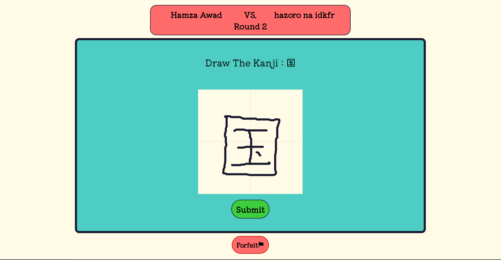
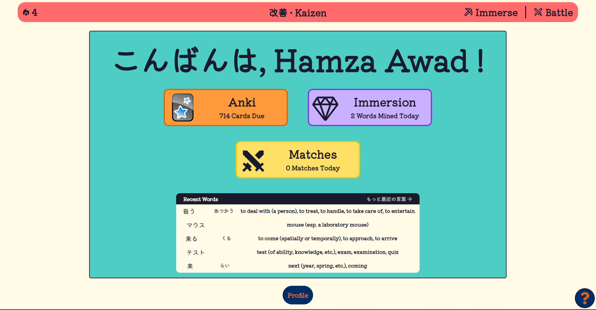
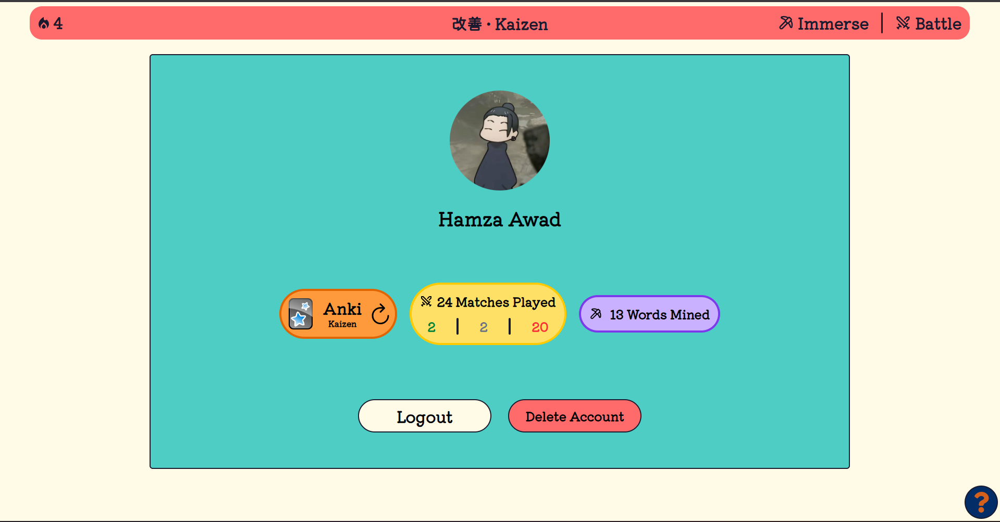

# 改善 • Kaizen
## A Japanese Immersion Platform, for those lazy ;)
### By Hazoro
Live at [kaizen.appwrite.network](https://kaizen.appwrite.network)

Ever felt lazy to try and immerse yourself into videos, anime, books and stuff while learning 日本語, Japanese?

Well I also do ;-;
So I have made this MERN Stack Project to help me immerse easily.


### PLEASE CHECK GUIDE BEFORE USAGE, bottom right in dashboard
# Main Features :
## 1- Immersion Page
Supported immersion methods : 
- Books (PDF & Text Files)
- Videos (Subtitles File Recommended)
- YouTube Videos
If subtitles are provided for the video. A synced subtitles bar is shown that u can select words to lookup automatically.
Anki Integration : You can add new words to your Anki Collection for memorization.



## 2- Matches : Test Your JLPT Vocab & Kanji
Invite friends to an online match for testing your knowledge together !



## 3- Stats, Streak, and More
Track your daily progress using the main dashboard, you can also lookup your recently mined words during immersion.

To view all-time stats, check your user profile.



# Setup (Node.js)
## FRONTEND :
make a .env file with VITE_FRONTEND_URL and VITE_BACKEND_URL inside ./client/
``sh
cd client
npm install
npm run dev
```
## Backend:

make a .env file with port,mongo_uri,jwt_secret,google_client_id,google_client_secret,cdn_key (hackclub cdn),hack_key (hackai, not used so ignore ig),frontend_url,yt_cookie (not used, ignore),sup_api_key (supadata key for fetching yt subtitles) inside ./server/

```.sh
cd server
npm install
npm run dev
```
# NOTE
I spend 15-20 hours refactoring features coz hackai and jotoba (online dictionary api) both went down and my website had many features depending on them :pray:
# AI-DECLARATION ( Claude )
- Help with finding a method to parse VTT
- Help ebuggin the reason for yt subtitles not being fetched properly
- pixel comparison for kanji grading
- more minor usage especially with debugging

With 💖 By Hazoro
